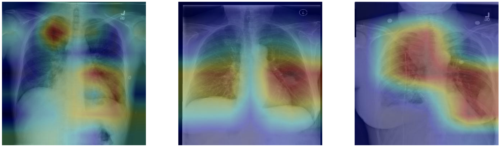

# AI_for_Medecine

This deeplearning.ai Specialization is divided into 3 courses each counting 3 practical projects:
- Diagnosis
- Treatment
- Prognosis

## AI for Medical Diagnosis:
- Project 1: Chest X-Ray Medical Diagnosis with Deep Learning.
- Project 2: Evaluation of Diagnostic Models.
- Project 3: Brain Tumor Auto-Segmentation for Magnetic Resonance Imaging (MRI).

